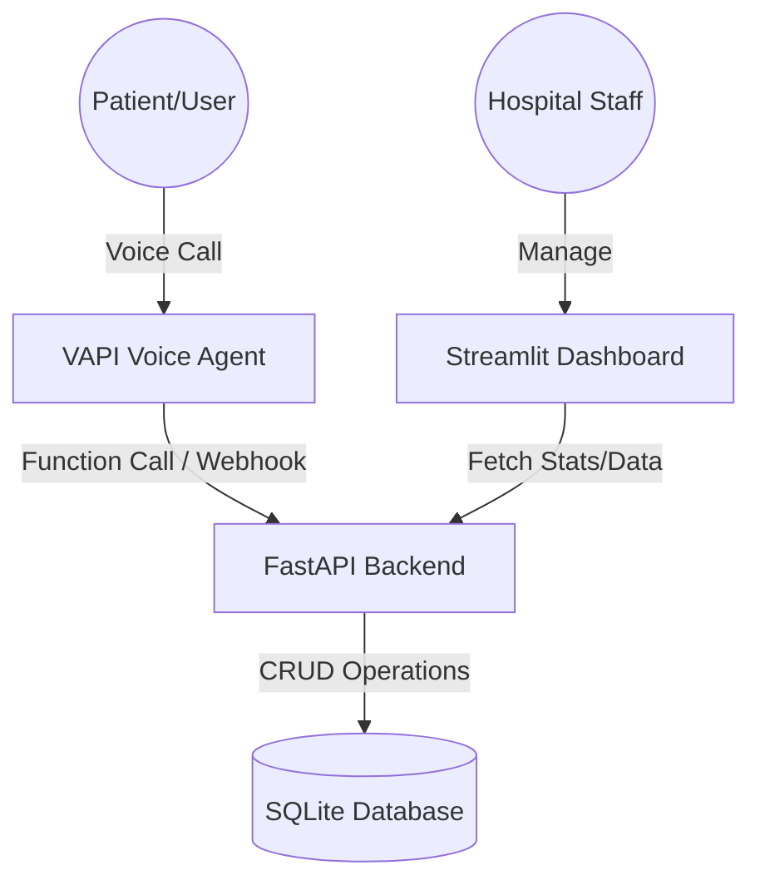

# 🏥 VAPI Voice Agent — Hospital Appointment System

[](https://huggingface.co/spaces/alwaysprince05e/voice-agent)
[](https://github.com/alwaysprince05/voice-agent)

An industry-grade AI-powered voice agent backend designed for automated hospital appointment management. This system integrates seamlessly with **VAPI** to provide a natural, conversational experience for patients while offering a premium management dashboard for hospital staff.

---

## 🌟 Key Features

- **🤖 AI Voice Integration**: Fully compatible with VAPI.ai for natural language appointment booking and cancellation.
- **📊 Real-time Dashboard**: A premium Streamlit-based portal with live system metrics and appointment visualization.
- **⚡ High Performance**: Built on **FastAPI** for ultra-low latency responses during voice interactions.
- **💾 Robust Persistence**: SQLite database with SQLAlchemy ORM for reliable data management.
- **🌐 Cloud Ready**: Pre-configured for deployment on **Hugging Face Spaces** using Docker and Nginx.

---

## 🏗️ System Architecture



---

## 🚀 Live Access

| Service | Link |
| :--- | :--- |
| **Management Dashboard** | [View Portal](https://huggingface.co/spaces/alwaysprince05e/voice-agent) |
| **API Endpoint (for VAPI)** | `https://alwaysprince05e-voice-agent.hf.space/api` |

---

## 🔌 VAPI Integration Guide

To connect your VAPI assistant to this backend:

1.  **Server URL**: Set your VAPI Assistant's "Server URL" to:
    `https://alwaysprince05e-voice-agent.hf.space/api`
2.  **Define Tools**: Add the following tool functions in the VAPI dashboard:
    -   `schedule_appointment`: Parameters: `patient_name`, `reason`, `start_time` (ISO format).
    -   `cancel_appointment`: Parameters: `patient_name`, `date` (YYYY-MM-DD).
    -   `list_appointments`: Parameters: `date` (YYYY-MM-DD).

---

## 🛠️ Technology Stack

- **Backend**: Python, FastAPI, Uvicorn
- **Database**: SQLAlchemy, SQLite
- **Frontend**: Streamlit, Pandas
- **Deployment**: Docker, Nginx, Hugging Face Spaces
- **Communication**: RESTful API, JSON

---

## 💻 Local Development

### 1. Clone the Repository
```bash
git clone https://github.com/alwaysprince05/voice-agent.git
cd voice-agent
```

### 2. Setup Environment
```bash
python -m venv .venv
source .venv/bin/activate
pip install -r requirements.txt
```

### 3. Run Services
**Start Backend:**
```bash
python backend.py
```
**Start Dashboard:**
```bash
streamlit run dummy_frontend.py
```

---

## 📄 License
This project is open-source and available under the MIT License.

---
<div align="center">
  Built with ❤️ for Modern Healthcare
</div>